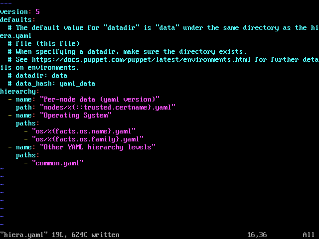

# Create a Hiera hierarchy

[Previous](create-environment.md) \| [Home](index.md) \| [Next](forge.md)

The default contents of 'hiera.yaml' are:
```
---
version: 5
hierarchy:
  - name: "Per-node data (yaml version)"
    path: "nodes/%{::trusted.certname}.yaml"
  - name: "Other YAML hierarchy levels"
    paths:
      - "common.yaml"
```

This means that when looking for configurations to apply to our node agent, it look for a YAML file with the node's name, then in 'common.yaml'. It will apply values from 'common.yaml' only if a value doesn't exist in the node-specific file.

Every environment has its own hierarchy. You can use a single Puppet server with multiple environments to serve the needs of your campus servers, campus desktops, HPC infrastructure and HPC compute nodes.

More examples of hierarchies:
```
---
version: 5
hierarchy:
  - name: "Per-node data"
    path: "nodes/%{trusted.certname}.yaml"
  - name: "Per-group data"
    paths:
      - "groups/%{group}.yaml"
      - "groups/common.yaml"
  - name: "Operating System"
    paths:
      - "os/%{facts.os.name}/%{facts.os.release.major}.yaml"
      - "os/%{facts.os.name}/common.yaml"
      - "os/%{facts.os.family}.yaml"
  - name: "Defaults"
    path: "common.yaml"
```

The configuration above works well for a heterogeneous set of campus desktops where you have multiple operating systems and multiple versions per operating system. In the case where desktops with a similar function share a part of their name (all Mathematics department machines start with 'math'), the per group configurations also come in handy. The 'group' variable can be defined at the top of 'manifests/site.pp':  
   `$group = regsubst($::trusted['hostname'], '^(\D+).*', '\1')`  
   This regular expression says strip everything from the node's hostname starting at the first number. Therefore 'math123.uni.ac' becomes 'math'.

In a system where your operating systems are all the same (like an HPC), the "Operating System" level can be removed:  
```
---
version: 5
hierarchy:
  - name: "Per-node data"
    path: "nodes/%{trusted.certname}.yaml"
  - name: "Per-group data"
    paths:
      - "groups/%{group}.yaml"
      - "groups/common.yaml"
  - name: "Defaults"
    path: "common.yaml"
```

For this workshop, let's add an "Operating System" level. Add the following to '/etc/puppetlabs/code/environments/test/hiera.yaml'  
```
---
version: 5
hierarchy:
  - name: "Per-node data (yaml version)"
    path: "nodes/%{trusted.certname}.yaml"
  - name: "Operating System"
    paths:
      - "os/%{facts.os.name}.yaml"
      - "os/%{facts.os.family}.yaml"
  - name: "Other YAML hierarchy levels"
    paths:
      - "common.yaml"
```



Applying the configuration does not cause errors. Non-existent Hiera files are ignored silently.  
`sudo /opt/puppetlabs/bin/puppet agent --verbose --onetime --no-daemonize --server workshop.vm --environment test`


[Previous](create-environment.md) \| [Home](index.md) \| [Next](forge.md)
