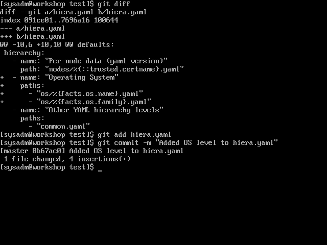
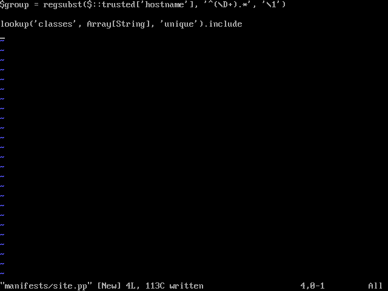
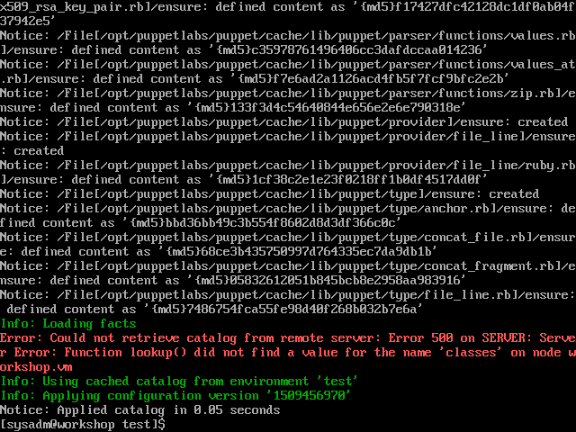
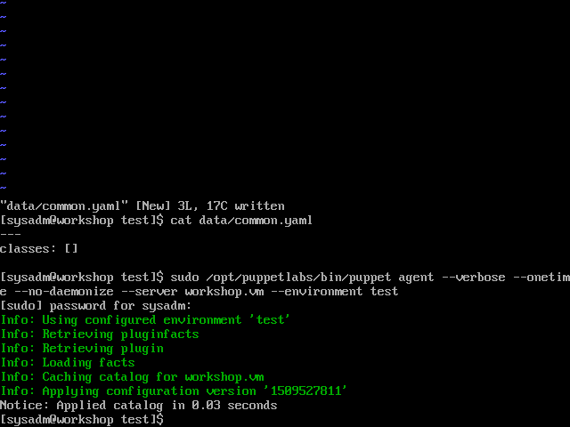
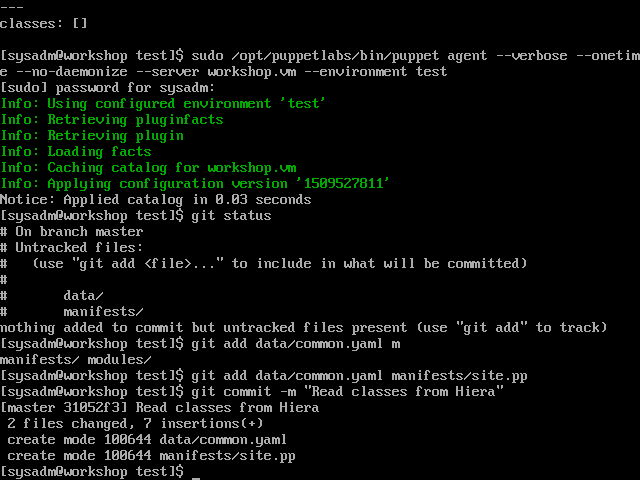

# Create a Hiera hierarchy

[Previous](create-environment.md) \| [Home](index.md) \| [Next](forge.md)

## Hiera hierarchies

The default contents of 'hiera.yaml' are:
```yaml
---
version: 5
hierarchy:
  - name: "Per-node data (yaml version)"
    path: "nodes/%{::trusted.certname}.yaml"
  - name: "Other YAML hierarchy levels"
    paths:
      - "common.yaml"
```

This means that when looking for configurations to apply to our node agent, it look for a YAML file with the node's name, then in 'common.yaml'. It will apply values from 'common.yaml' only if a value doesn't exist in the node-specific file.

Every environment has its own hierarchy. You can use a single Puppet server with multiple environments to serve the needs of your campus servers, campus desktops, HPC infrastructure and HPC compute nodes.

## More examples of hierarchies

```yaml
---
version: 5
hierarchy:
  - name: "Per-node data"
    path: "nodes/%{trusted.certname}.yaml"
  - name: "Per-group data"
    paths:
      - "groups/%{group}.yaml"
      - "groups/common.yaml"
  - name: "Operating System"
    paths:
      - "os/%{facts.os.name}/%{facts.os.release.major}.yaml"
      - "os/%{facts.os.name}/common.yaml"
      - "os/%{facts.os.family}.yaml"
  - name: "Defaults"
    path: "common.yaml"
```

The configuration above works well for a heterogeneous set of campus desktops where you have multiple operating systems and multiple versions per operating system. In the case where desktops with a similar function share a part of their name (all Mathematics department machines start with 'math'), the per group configurations also come in handy. The 'group' variable can be defined at the top of 'manifests/site.pp':  
   `$group = regsubst($::trusted['hostname'], '^(\D+).*', '\1')`  
   This regular expression says strip everything from the node's hostname starting at the first number. Therefore 'math123.uni.ac' becomes 'math'.

In a system where your operating systems are all the same (like an HPC), the "Operating System" level can be removed:  
```yaml
---
version: 5
hierarchy:
  - name: "Per-node data"
    path: "nodes/%{trusted.certname}.yaml"
  - name: "Per-group data"
    paths:
      - "groups/%{group}.yaml"
      - "groups/common.yaml"
  - name: "Defaults"
    path: "common.yaml"
```

For this workshop, let's add an "Operating System" level. Add the following to '/etc/puppetlabs/code/environments/test/hiera.yaml'  
```yaml
---
version: 5
hierarchy:
  - name: "Per-node data (yaml version)"
    path: "nodes/%{trusted.certname}.yaml"
  - name: "Operating System"
    paths:
      - "os/%{facts.os.name}.yaml"
      - "os/%{facts.os.family}.yaml"
  - name: "Other YAML hierarchy levels"
    paths:
      - "common.yaml"
```


Applying the configuration does not cause errors. Non-existent Hiera files are ignored silently.  
`sudo /opt/puppetlabs/bin/puppet agent --verbose --onetime --no-daemonize --server workshop.vm --environment test`

Let's commit our changes:  
   `git add hiera.yaml`  
   `git commit -m "Added OS level to hiera.yaml"`




## Set up environment to read list of classes to apply from Hiera

Puppet reads the 'manifests/site.pp' file to determine which classes to apply to a node. We need to tell it to read that list from Hiera with the Hiera '[lookup](https://puppet.com/docs/puppet/5.3/hiera_use_function.html#examples)' function. Add `lookup('classes', Array[String], 'unique').include` to 'manifests/site.pp'. This will cause Puppet to read an array of strings from the 'classes' key in our Hiera hierarchy, keeping only unique entries, and using that as a list of classes to include.



Applying the configuration now gives an error, because the 'classes' key doesn't exist:  
`sudo /opt/puppetlabs/bin/puppet agent --verbose --onetime --no-daemonize --server workshop.vm --environment test`



To make it happy, let's have it apply an empty array of classes by default. Edit 'data/common.yaml' to include  
```yaml
---
classes: []
```



Let's commit our changes:  
`git add data/common.yaml manifests/site.pp`  
`git commit -m "Read classes from Hiera"`




[Previous](create-environment.md) \| [Home](index.md) \| [Next](forge.md)
