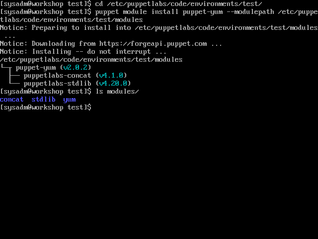
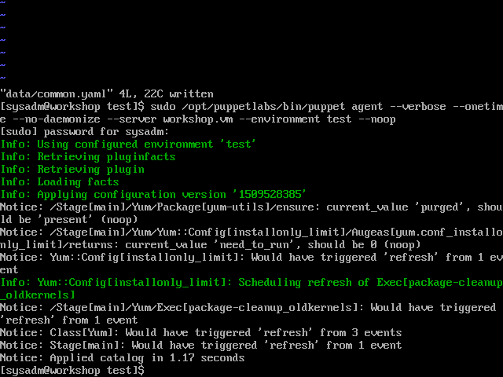

# Install a module from the Puppet Forge

[Previous](create-hierarchy.md) \| [Home](index.md) \| [Next](override.md)

The [Puppet Forge](https://forge.puppet.com) is a repository of modules for Puppet.

In this example we'll install a module which will manage our YUM repositories. Searching for 'yum', we find the first 'Approved' module is 'puppet/yum'. It has a high quality score, a high community rating and a lot of downloads. It'll probably suit our purposes.

## Install the module

To install the module, we can either download it manually and check its dependencies manually, or have Puppet sort it out for us:  
`puppet module install puppet-yum --modulepath /etc/puppetlabs/code/environments/test/modules`

We need to specify the path to the modules directory because we're not running the command as 'root'. We also have the option of installing the modules into '/etc/puppetlabs/code/modules', sharing the modules between all environments.



Notice how it automatically installed two other modules (puppetlabs-stdlib and puppetlabs-concat) as dependencies.

Let's commit our changes:  
   `git add modules`  
   `git commit -m "Added puppet-yum module"`

## Include the module

We've installed the module, but it's not doing anything yet. Let's include the module in 'data/common.yaml' but not configure it. Then let's see what the module will try to do without any configuration.

1. Edit 'data/common.yaml' to include the 'yum' class  
   ```yaml
   ---
   classes:
     - yum
   ```

1. Run the agent in 'dryrun' or 'noop' mode  
   ```bash
   sudo /opt/puppetlabs/bin/puppet agent --verbose --onetime --no-daemonize --server workshop.vm --environment test --noop
   ```

   

1. We can see that it wants to install the 'yum-utils' package, and set a couple of configuration options for deleting old, unused kernels. We're quite happy with that, so have it apply  
   ```bash
   sudo /opt/puppetlabs/bin/puppet agent --verbose --onetime --no-daemonize --server workshop.vm --environment test
   ```

## Configure the module

Read the module's [readme]https://forge.puppet.com/puppet/yum/readme) on the Forge and the 'manifests/init.pp' file to get an idea of how to configure the module.


[Previous](create-hierarchy.md) \| [Home](index.md) \| [Next](override.md)
