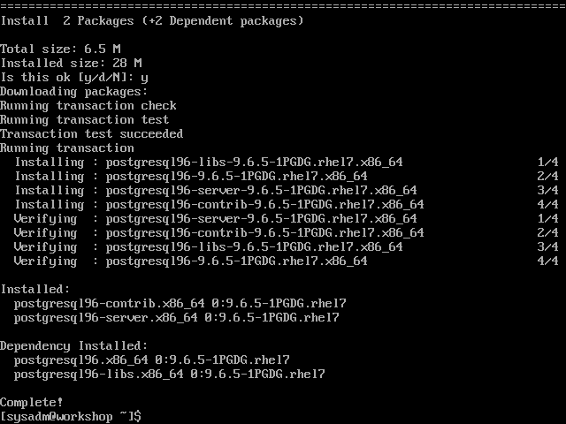
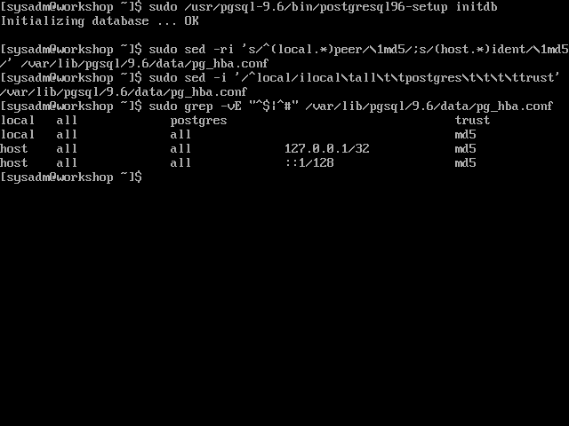
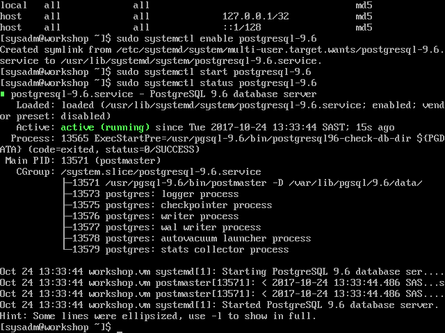

# Install PostgreSQL 9.6

[Previous](install-puppet-server.md) \| [Home](index.md) \| [Next](install-puppet-db.md)

1. Install PostgreSQL 9.6 from the PGDG repository. CentOS 7 ships with PostgreSQL 9.2. The PGDG repository provides version 9.6.  
   `sudo yum install postgresql96-{server,contrib}`

   
1. Initialise the database.  
   `sudo /usr/pgsql-9.6/bin/postgresql96-setup initdb`
1. Set up authentication
   1. Allow MD5 authentication from localhost  
      `sudo sed -ri 's/^(local.*)peer/\1md5/;s/^(host.*)ident/\1md5/' /var/lib/pgsql/9.6/data/pg_hba.conf`
   1. Trust the 'postgres' user  
      `sudo sed -i '/^local/ilocal\tall\t\tpostgres\t\t\t\ttrust' /var/lib/pgsql/9.6/data/pg_hba.conf`

   
1. Enable and start the service.  
   `sudo systemctl enable postgresql-9.6`  
   `sudo systemctl start postgresql-9.6`

   

[Previous](install-puppet-server.md) \| [Home](index.md) \| [Next](install-puppet-db.md)
