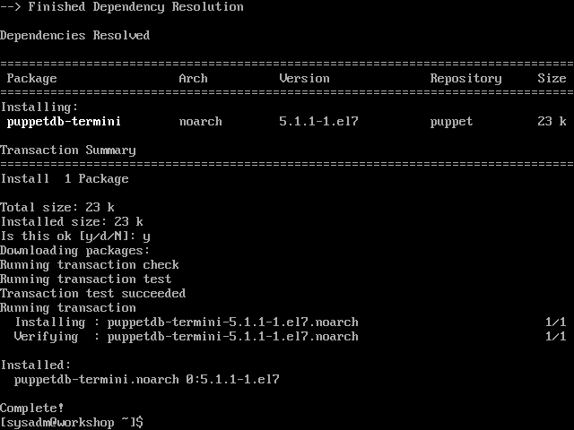
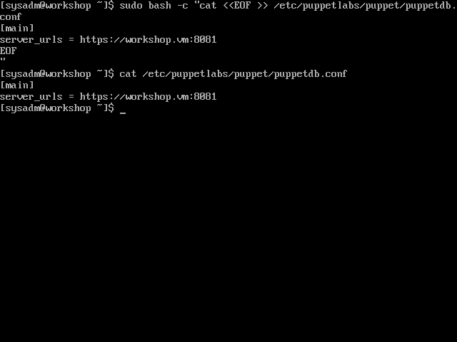
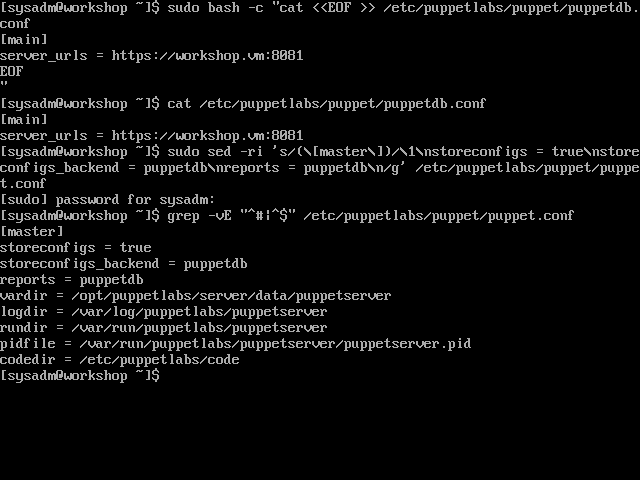
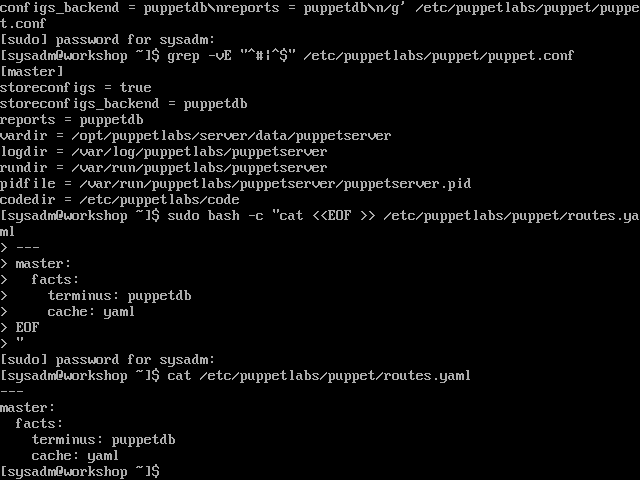

# Connect the Puppet Server to the Puppet DB

[Previous](install-puppet-db.md) \| [Home](index.md)

From the [official documentation](https://puppet.com/docs/puppetdb/5.1/connect_puppet_master.html),
>Once PuppetDB is installed and running, configure your Puppet master(s) to use it. When properly connected to PuppetDB, Puppet masters will do the following:
> - Send every node’s catalog, facts, and reports to PuppetDB
> - Query PuppetDB when compiling node catalogs that collect exported resources

1. Install Puppet DB termini  
   `sudo yum install puppetdb-termini`

   
1. Create the config files
   1. Set up where to find the PuppetDB web service
      ```
      sudo bash -c "cat <<EOF >> /etc/puppetlabs/puppet/puppetdb.conf
      [main]
      server_urls = https://workshop.vm:8081
      EOF
      "
      ```
      
   1. Set up the Puppet Server's reporting and config storage to use PuppetDB
      ```
      sudo sed -ri 's/(\[master\])/\1\nstoreconfigs = true\nstoreconfigs_backend = puppetdb\nreports =    puppetdb\n/g' /etc/puppetlabs/puppet/puppet.conf
      ```
      

   1. Set up the Puppet Server's fact storage to use PuppetDB
      ```
      sudo bash -c "cat <<EOF >> /etc/puppetlabs/puppet/routes.yaml
      ---
      master:
        facts:
          terminus: puppetdb
          cache: yaml
      EOF
      "
      ```
      
1. Restart the Puppet Server  
   `systemctl restart puppetserver`

[Previous](install-puppet-db.md) \| [Home](index.md)
