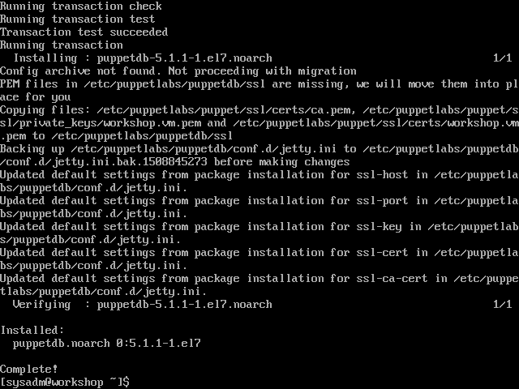
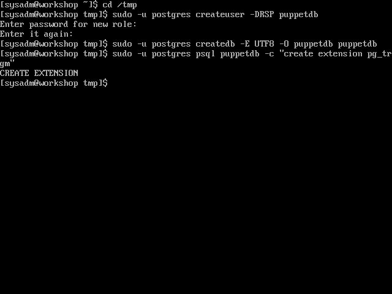
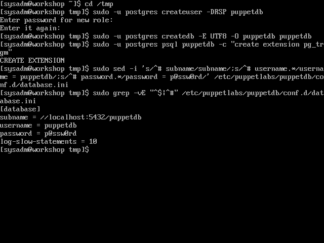
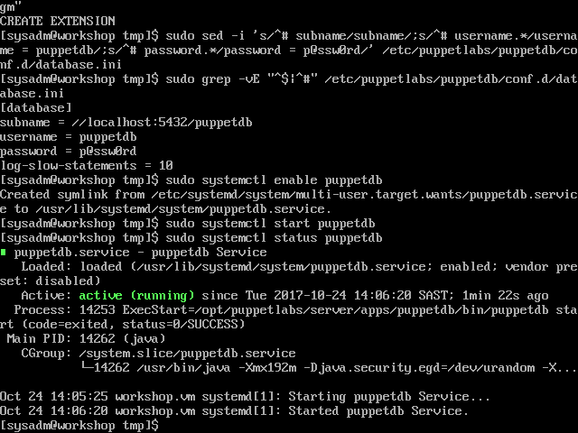

# Install Puppet DB

[Previous](install-postgresql.md) \| [Home](index.md) \| [Next](install-puppet-db-termini.md)

1. Install Puppet DB  
   `sudo yum install puppetdb`

   
1. Create the 'puppetdb' PostgreSQL user and database
   1. When we 'sudo' to 'postgres' in the commands below, it's going to try to read the current working directory as the 'postgres' user. The 'postgres' user doesn't have access to '/home/sysadm', so to avoid 'permission denied' errors, change directory to '/tmp'.  
   `cd /tmp`
   1. Create the 'puppetdb' user. You will be prompted for a password. Choose your own, just make sure it matches the one you set in '/etc/puppetlabs/puppetdb/conf.d/database.ini' later. This example uses 'p@ssw0rd'.  
      `sudo -u postgres createuser -DRSP puppetdb`  
   1. Create the 'puppetdb' database  
      `sudo -u postgres createdb -E UTF8 -O puppetdb puppetdb`  
   1. Enable the 'pg_trgm' extension on the 'puppetdb' database  
      `sudo -u postgres psql puppetdb -c "create extension pg_trgm"`

   
1. Set PuppetDB to connect to the new database  
   ```bash
   sudo sed -i 's/^# subname/subname/;s/^# username.*/username = puppetdb/;s/^# password.*/password = p@ssw0rd/' /etc/puppetlabs/puppetdb/conf.d/database.ini
   ```

   
1. (Optional) In production you may want to increase PuppetDB's JVM heap size. Here we set it to 1GB.  
   `sudo sed -ri 's/^(JAVA_ARGS="-Xmx).*"/\11g"/' /etc/sysconfig/puppetdb`
1. Enable and start the service  
   `sudo systemctl enable puppetdb`  
   `sudo systemctl start puppetdb`

   

[Previous](install-postgresql.md) \| [Home](index.md) \| [Next](install-puppet-db-termini.md)
