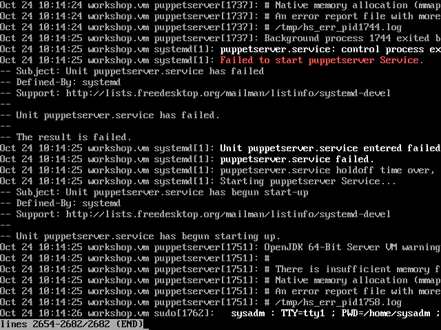

# Install Puppet Server 5

[Previous](configure-vm.md) \| [Home](index.md) \| [Next](install-postgresql.md)

1. Install Puppet Server from the repository. Note that the Puppet Agent is a dependency and is installed automatically.  
   `sudo yum install puppetserver`
1. Enable and start the service  
   `sudo systemctl enable puppetserver`  
   `sudo systemctl start puppetserver`  

     
   Ouch, something is wrong. Let's take a look at the journal  
   `sudo journalctl -xe`

     
   Ah, we need more memory for the server to start up. Let's increase the swap file size.
   1. Turn off swap  
      `sudo swapoff -a`
   1. Take a look at its current size  
      `sudo lvdisplay /dev/vg0/swap`
   1. Resize the swap volume to 2GB  
      `sudo lvresize -l 512 /dev/vg0/swap`
   1. Reformat the swap volume  
      `sudo mkswap /dev/vg0/swap`
   1. Turn on swap  
      `sudo swapon -a`  

     

   Let's try to start that service again.  
   `sudo systemctl start puppetserver`  
   

   On first startup the server generates its CA certificate and a new certificate for the server.  
   `sudo find /etc/puppetlabs/puppet/ssl/ -name "*.pem"`  
   `sudo /opt/puppetlabs/bin/puppet cert list --all`  
   
1. Test that the agent on the server is happy with the certificates  
   `sudo /opt/puppetlabs/bin/puppet agent --test --server workshop.vm`  
   

[Previous](configure-vm.md) \| [Home](index.md) \| [Next](install-postgresql.md)
