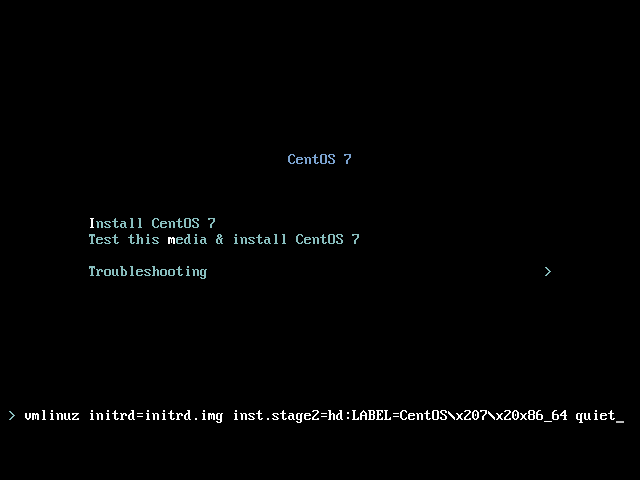
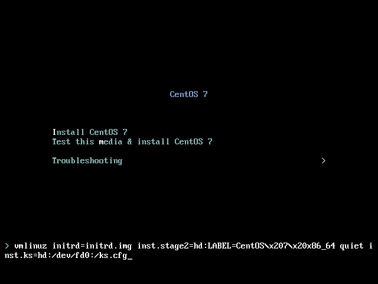
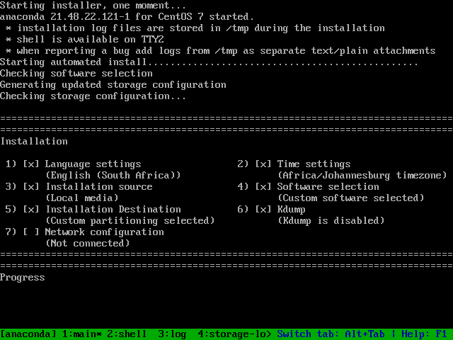

# Install a new CentOS 7.4 VM

### Requirements

- A new VM
  - minimum 1 core, 2GB RAM, 32GB disk, 1 network interface
  - recommended 4 cores, 4GB RAM, 32GB disk, 1 network interface
  - (in real production) 4 cores, 8GB RAM, 32GB disk, 1 network interface
- An installation source
  - [CentOS 7.4 DVD ISO](http://centos.mirror.ac.za/7.4.1708/isos/x86_64/CentOS-7-x86_64-DVD-1708.iso)
  - [CentOS 7.4 NetInstall ISO](http://centos.mirror.ac.za/7.4.1708/isos/x86_64/CentOS-7-x86_64-NetInstall-1708.iso) and full (and fast) internet access
- A kickstart file
  - (with network) we'll use [this file](https://github.com/cwmoller/workshop-puppet5/raw/master/ks-net.cfg)
  - (with no network) a floppy disk image will be made available with [this file](https://github.com/cwmoller/workshop-puppet5/raw/master/ks.cfg)

### Let's go!!

1. Create a VM with your favourite hypervisor. If your machine can afford it, give the VM 4GB RAM. For this workshop the number of cores is not important, you'll want 4 cores in production though. Even in production you won't need more than 32GB disk.
1. Boot the VM from the ISO, select `Install CentOS 7` and press `TAB`.
   
1. At the kernel parameters prompt, we'll add the `inst.ks` parameter, telling the installer to fetch and use a [Kickstart](kickstart.md) file.
   
   - (with network, installing from DVD) add `inst.ks=https://github.com/cwmoller/workshop-puppet5/raw/master/ks.cfg`
   - (with network, installing from internet) add `inst.ks=https://github.com/cwmoller/workshop-puppet5/raw/master/ks-net.cfg`
   - (with no network, floppy disk image added) add `inst.ks=hd:/dev/fd0:/ks.cfg`
1. Wait for the installation to complete (shouldn't be more than 10 minutes)
   

   While we're waiting, let's review what we told [kickstart](kickstart.md) to do.
1. Log in to your new VM
   - username: `root`
   - password: `password`
