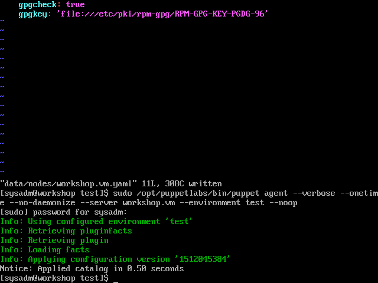
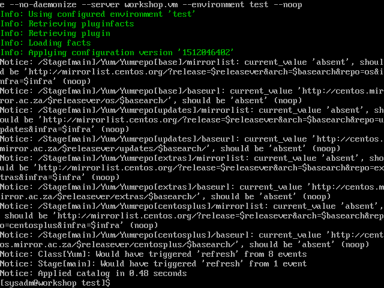

## Override the configuration

[Previous](forge.md) \| [Home](index.md)

We've set up a good baseline for a generic CentOS machine's YUM repositories, and all our CentOS machines should get that configuration. Our Puppet server machine is special though, and needs some special configurations.

### Add a more specific configuration

Let's add the PostgreSQL repo.

1. Create the 'data/nodes' directory  
   `mkdir data/nodes`
1. Create a node-specific configuration file for 'workshop.vm'  
   `touch data/nodes/workshop.vm.yaml`
1. Add the configuration for the PostgreSQL repo  
   ```yaml
   ---
   yum::managed_repos:
     - 'pgdg96'
   yum::repos:
     'pgdg96':
       descr: 'PostgreSQL 9.6 $releasever - $basearch'
       baseurl: 'https://download.postgresql.org/pub/repos/yum/9.6/redhat/rhel-$releasever-$basearch'
       enabled: true
       gpgcheck: true
       gpgkey: 'file:///etc/pki/rpm-gpg/RPM-GPG-KEY-PGDG-96'

   ```
1. Run the agent in 'dryrun' or 'noop' mode  
   ```bash
   sudo /opt/puppetlabs/bin/puppet agent --verbose --onetime --no-daemonize --server workshop.vm --environment test --noop
   ```

   

   We can see that no changes are required. We copied the existing configuration perfectly, so there's nothing to update.

1. Let's commit our changes:  
   `git add data/nodes`  
   `git commit -m "Added configuration for workshop.vm"`

### Override a less specific configurations

We've set up our repositories for CentOS to ignore the 'mirrorlist' attribute and set the 'baseurl' attribute. But what if 'workshop.vm' is very special and needs to override that global setting?

Let's override the repos we created in 'data/os/CentOS.yaml' in 'data/nodes/workshop.vm.yaml'.

1. Edit 'data/nodes/workshop.vm.yaml' with the following contents  

   ```yaml
   ---
   yum::managed_repos:
     - 'pgdg96'
   yum::repos:
     'pgdg96':
       descr: 'PostgreSQL 9.6 $releasever - $basearch'
       baseurl: 'https://download.postgresql.org/pub/repos/yum/9.6/redhat/rhel-$releasever-$basearch'
       enabled: true
       gpgcheck: true
       gpgkey: 'file:///etc/pki/rpm-gpg/RPM-GPG-KEY-PGDG-96'
     'base':
       baseurl: 'absent'
       mirrorlist: 'http://mirrorlist.centos.org/?release=$releasever&arch=$basearch&repo=os&infra=$infra'
     'updates':
       baseurl: 'absent'
       mirrorlist: 'http://mirrorlist.centos.org/?release=$releasever&arch=$basearch&repo=updates&infra=$infra'
     'extras':
       baseurl: 'absent'
       mirrorlist: 'http://mirrorlist.centos.org/?release=$releasever&arch=$basearch&repo=extras&infra=$infra'
     'centosplus':
       baseurl: 'absent'
       mirrorlist: 'http://mirrorlist.centos.org/?release=$releasever&arch=$basearch&repo=centosplus&infra=$infra'
   ```

1. Run the agent in 'dryrun' or 'noop' mode  
   ```bash
   sudo /opt/puppetlabs/bin/puppet agent --verbose --onetime --no-daemonize --server workshop.vm --environment test --noop
   ```

   

   We can see that it wants to set values for 'mirrorlist', and remove the 'baseurl' values. We've succeeded in telling Puppet that this machine's configuration overrides the more general per-OS configuration.

[Previous](forge.md) \| [Home](index.md)
